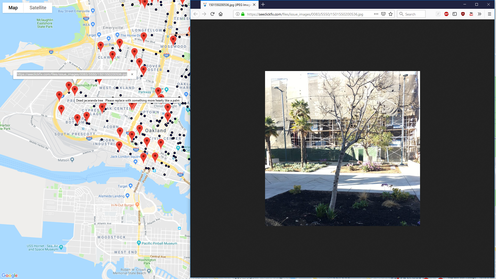

# ETL--hazardTrees

# Background

SeeClickFix is the largest source of reports, with over 200k rows. Note the 'REQUESTID' column as different number formats depending on the source, which unfortunately is NOT the same number as 'service_request-id' from the SeeClickFix API. Also note some sources (such as 'Phone or Email') can have no location data.

# Process

#### Extract:
To replicate these results with updated service reports, simply download the latest CSV from https://data.oaklandnet.com/Infrastructure/Service-requests-received-by-the-Oakland-Call-Cent/quth-gb8e and load it; simply by running the other cells you will start to compile the latest results.

#### Transform:

* I want to isolate, for example, reports relating to trees that are still ongoing.  I search for the word 'Tree' in the 'DESCRIPTION" column, which does NOT pull up "Streets - Potholes/Depression"
* Unfortunately since Oakland doesn't retain the user-input description which can contain a lot flavorful commentary; for example one request the user wrote "In front of 906 Washington st. There  is a tree grate that has been an trip hazard for quite sometime, please assist with resolving this issue."

* With a 25.79% match rate, I proceed to tag incidents with their matches, basically separating incidents with images, applied a hover that has the description and info box with the image URL.
LIMITATION: I would have liked to display the image but the gmaps API docs says string only. source: https://jupyter-gmaps.readthedocs.io/en/latest/api.html

#### Load:

* Sources of data: (links and instructions throughout the jupyter notebook) City of Oakland Service Requests, SeeClickFix, EPSG.io Coordinate Systems Worldwide, & Google Maps API

* SeeClickFix is an app meant for people to report hazards and other incidents to be addressed or resolved, usually by the local government.  The location data for reports tends to be very accurate because the submitter pins the location on a map. When searching for specific hazards, a search query in the app for a very basic word like 'tree' brings up a lot of false positives, basically any word that contains those letter in it, such as 'street' (if you search for the word tree in quotation marks, you get zero results).  There is no way to filter by fixed categories either unless you know the exact name of the category to type in.  They have an API that requires either coordinates or account ID but can pull up responses that are only partial matches (eg correct or nearby coordinates but not matching 'service_name' or 'requested_datetime' inputs).  URL: https://seeclickfix.com/open311/v2/docs

* The City of Oakland provides a large ongoing record of service requests.  One source of such reports is from SeeClickFix, but the city maintains different metadata (such as converting location from latitude/longitude to NAD 1983 StatePlane California III FIPS 0403 Feet and dropping some metadata in SeeClickFix such as description and the user-submitted photo).  However, their dataset (a CSV w/ >500k rows) is easier to filter/sort by different columns (such as by municipal district or request category) to acquire data which can then be plugged back into the SeeClickFix API.  Unfortunately the request ID reference numbers cannot be cross-referenced (you can find the reference number from Oakland in the SeeClickFix under comments as well as a field in the app called 'Remote Id' which cannot be searched in the SeeClickFix API).  The data can be access with a JSON query but times out due to the size of the dataset.  URL: https://data.oaklandnet.com/Infrastructure/Service-requests-received-by-the-Oakland-Call-Cent/quth-gb8e

* Types of transforming: cleaning, sorting, filtering (by SeeClickFix, by Tree incidents), splitting (date info for comparison purposes), converting (coordinates)

* Final production database: load coordinates & other metadata (CSV format) into Google Maps API using parameters described here: https://jupyter-gmaps.readthedocs.io/en/latest/api.html

